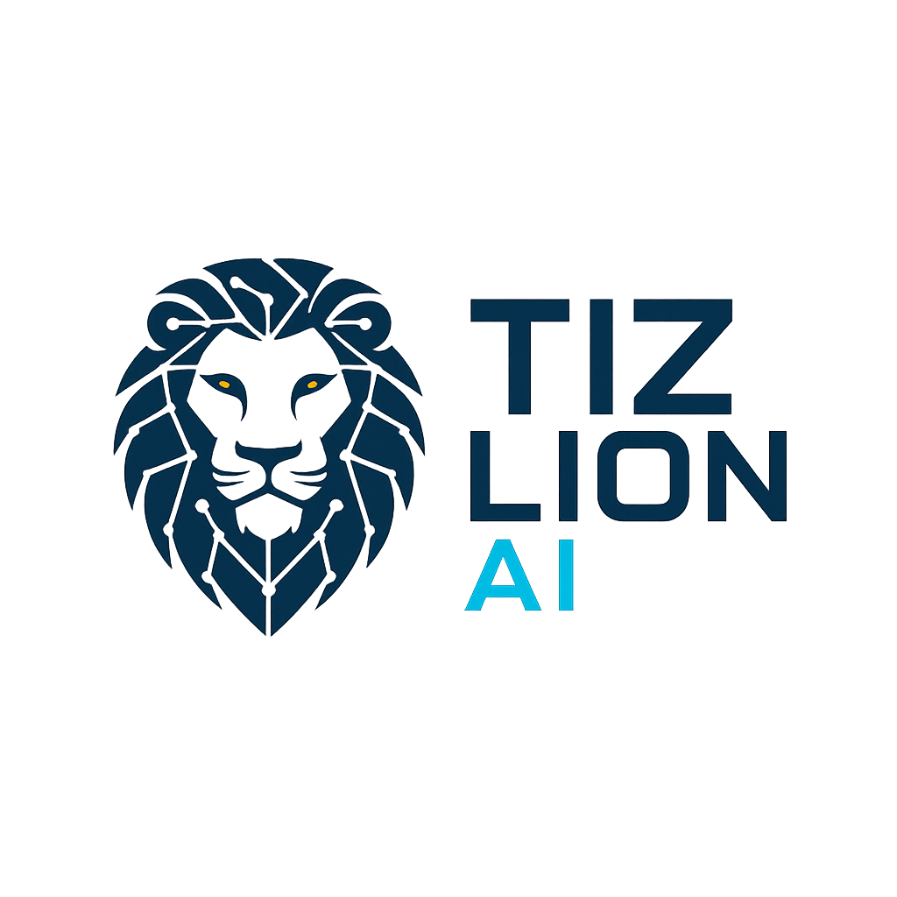
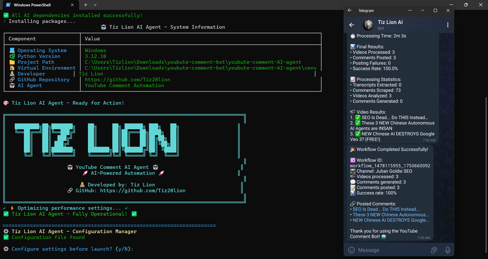
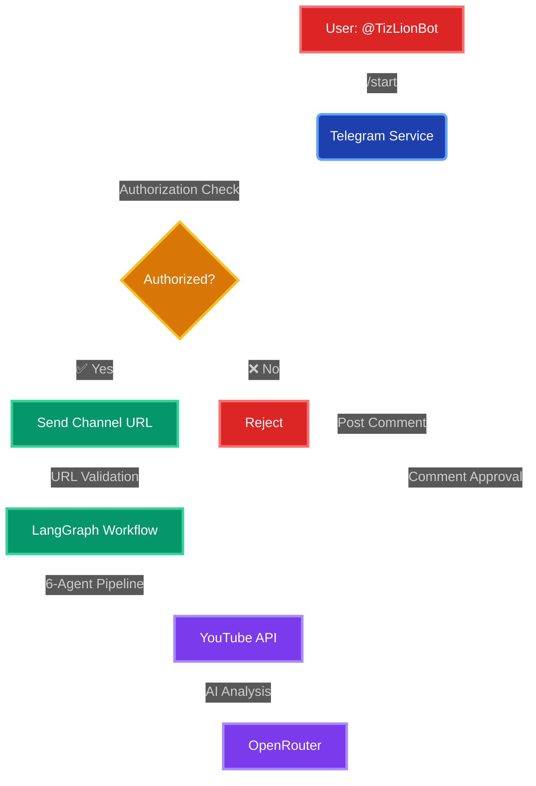

# 🦁 YouTube Comment AI Agent

<div align="center">



**Intelligent YouTube Comment Automation System**

[](https://python.org)
[](https://fastapi.tiangolo.com)
[](https://langchain-ai.github.io/langgraph/)
[](https://hub.docker.com/r/tiz20lion/youtube-comment-ai-agent)
[](LICENSE)

[🎥 **Watch Demo**](https://www.loom.com/share/ebc1e5a6011f440f838176c306b381f9?sid=3b81e1e4-0585-4dc6-9f30-25014948885e) | [📺 **YouTube Channel**](https://www.youtube.com/@TizLionAI) | [🐳 **Docker Hub**](https://hub.docker.com/r/tiz20lion/youtube-comment-ai-agent) | [💼 **LinkedIn**](https://www.linkedin.com/in/olajide-azeez-a2133a258)

</div>

## 🎬 Demo Video

<div align="center">
  <a href="https://www.loom.com/share/ebc1e5a6011f440f838176c306b381f9?sid=3b81e1e4-0585-4dc6-9f30-25014948885e" target="_blank">
    
  </a>
  
  **🎥 [▶️ WATCH FULL DEMO ON LOOM](https://www.loom.com/share/ebc1e5a6011f440f838176c306b381f9?sid=3b81e1e4-0585-4dc6-9f30-25014948885e)**
  
  *Click the image or link above to see the complete 6-agent AI workflow in action*
</div>

## 🗂️ System Architecture

<div align="center">
  
  <p><em>6-Agent Sequential Processing Pipeline with LangGraph Orchestration</em></p>
</div>

### 🔄 Workflow Diagram



## 🚀 Overview

AI-powered YouTube comment automation with intelligent 6-agent workflow.

### ✨ Key Features

- 🧠 **6-Agent AI Pipeline** - Intelligent content analysis & comment generation
- 💬 **Telegram Bot Control** - Real-time command & approval system
- 🔐 **OAuth2 Security** - Secure YouTube API integration
- 🐳 **Docker Ready** - One-click deployment to any platform
- 🌐 **VPS Deploy** - Automated cloud server setup

### 🆕 What's New

- 🖥️ **Web Dashboard** - Configure everything via web interface at `:7844`
- ⚙️ **No Manual .env** - Set API keys and settings through the web UI
- 🌐 **VPS Ready** - One-command deployment to any cloud server
- 📊 **Real-time Monitoring** - Track agent performance and metrics
- 🔧 **Smart Setup** - Zero-config start, configure later via web

📖 **[Complete VPS Deployment Guide](GOOGLE_CLOUD_DEPLOYMENT.md)** - Step-by-step cloud hosting instructions

## 🧠 Agent Workflow

1. **🔍 Channel Parser** - Extract video metadata
2. **📝 Content Extractor** - Process video descriptions  
3. **🕷️ Content Scraper** - Analyze existing comments
4. **🧠 AI Analyzer** - Smart content analysis
5. **✏️ Comment Generator** - Create human-like comments
6. **🚀 Comment Poster** - Secure OAuth2 posting

## 🗂️ Technical Stack

**FastAPI** • **LangGraph** • **OpenRouter AI** • **YouTube API v3** • **Telegram Bot** • **Docker**

## 📋 Requirements

- **Python 3.8+** / **Docker** / **VPS**
- **YouTube API v3** key
- **OpenRouter AI** account  
- **Telegram Bot** token
- **OAuth2** credentials (optional)

## 🚀 Quick Start

### 🖥️ Local Development
```bash
git clone https://github.com/Tiz20lion/youtube-comment-AI-agent.git
cd youtube-comment-AI-agent
pip install -r requirements.txt
python startup.py  # Interactive setup
# OR: python -m uvicorn app.main:app --host 0.0.0.0 --port 7844
```

### 🐳 Docker Deployment
```bash
# Pull & run
docker pull tiz20lion/youtube-comment-ai-agent:latest
docker run -p 7844:7844 --env-file .env tiz20lion/youtube-comment-ai-agent

# OR: Build from source
docker build -t youtube-ai-agent .
docker run -p 7844:7844 --env-file .env youtube-ai-agent
```

### 🌐 VPS Deployment
```bash
# One-command deployment
curl -fsSL https://raw.githubusercontent.com/Tiz20lion/youtube-comment-AI-agent/main/deploy-vps.sh | sudo bash

# OR: Google Cloud VPS
curl -fsSL https://raw.githubusercontent.com/Tiz20lion/youtube-comment-AI-agent/main/deploy-vps-gcp.sh | sudo bash
```

**✨ Features**: Auto-setup • Zero-config start • Web configuration • Smart error handling

## ⚙️ Configuration

### 🔐 Default Login Credentials
**First time login to the web dashboard:**
```
Username: TizlionAI
Password: TizlionAI
```
⚠️ **Security Note**: You will be required to change your password after first login.

### 🖥️ Web Interface (Recommended)
1. **Start the app**: `python startup.py` or `docker run -p 7844:7844 tiz20lion/youtube-comment-ai-agent`
2. **Open browser**: Navigate to `http://localhost:7844`
3. **Login**: Use the default credentials above for first-time access
4. **Configure**: Set all API keys and settings via the web dashboard
5. **Done**: No manual `.env` file editing needed!

### 📝 Manual .env (Alternative)
```env
# Required API Keys
GOOGLE_API_KEY=your_youtube_api_key
OPENROUTER_API_KEY=sk-or-v1-your-key
TELEGRAM_BOT_TOKEN=123456789:your_bot_token
TELEGRAM_ALLOWED_USERS=your_user_id

# Optional
ENABLE_COMMENT_POSTING=true
PORT=7844
```

## 🎮 Usage

1. **Telegram**: Send `/start` to your bot
2. **URL**: Send YouTube channel URL  
3. **Review**: Approve/reject AI comments
4. **Monitor**: Track via web dashboard at `:7844`

## 🗂️ Project Structure

```
app/
├── agents/         # 6 AI agents pipeline
├── services/       # YouTube, Telegram, AI APIs  
├── workflow/       # LangGraph orchestration
├── templates/      # Web dashboard
└── main.py         # FastAPI server (port 7844)
```


## 🤝 Contributing

**Fork** → **Branch** → **Commit** → **Pull Request**

## 📄 License

**MIT License** - Feel free to use and modify

## 🙏 Credits

**LangGraph** • **FastAPI** • **OpenRouter** • **YouTube API** • **Telegram Bot API**

## 📞 Support & Contact

<div align="center">

**Developed by Tiz Lion AI**

[](https://www.youtube.com/@TizLionAI)
[](https://www.linkedin.com/in/olajide-azeez-a2133a258)
[](https://github.com/Tiz20lion)

</div>

---

<div align="center">
  <strong>⭐ Star this repository if you find it useful!</strong>
</div> 
