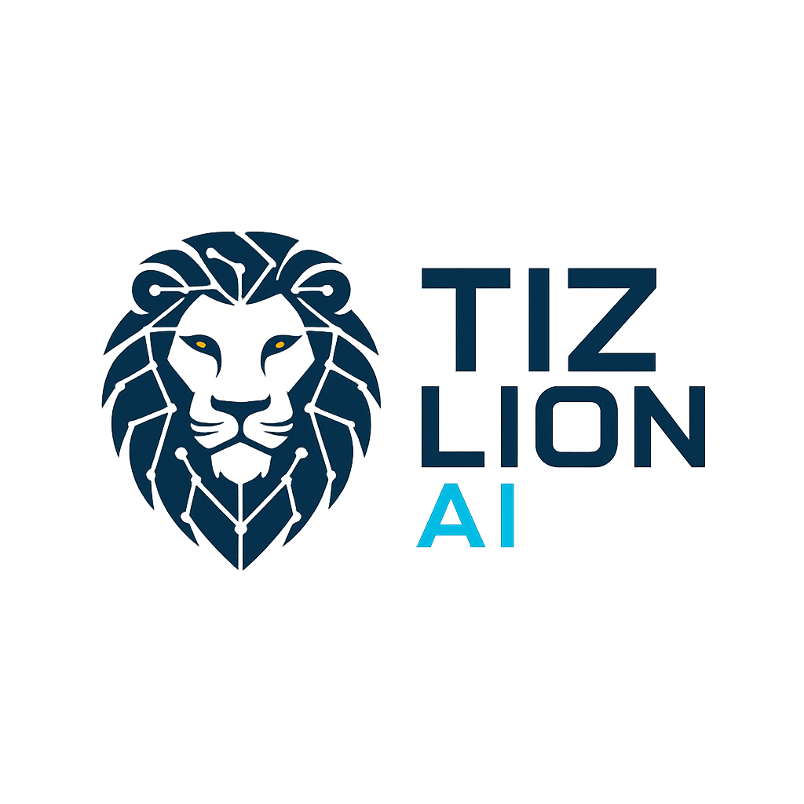
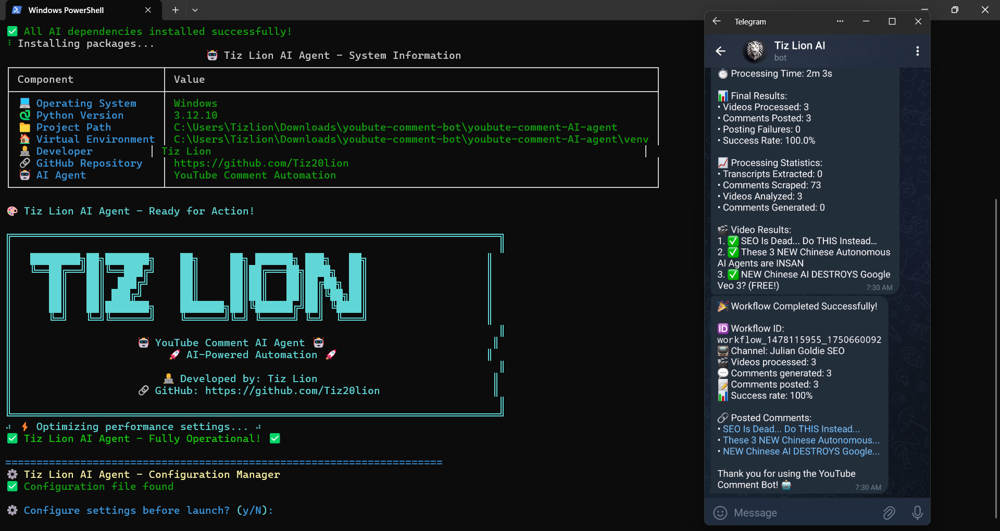
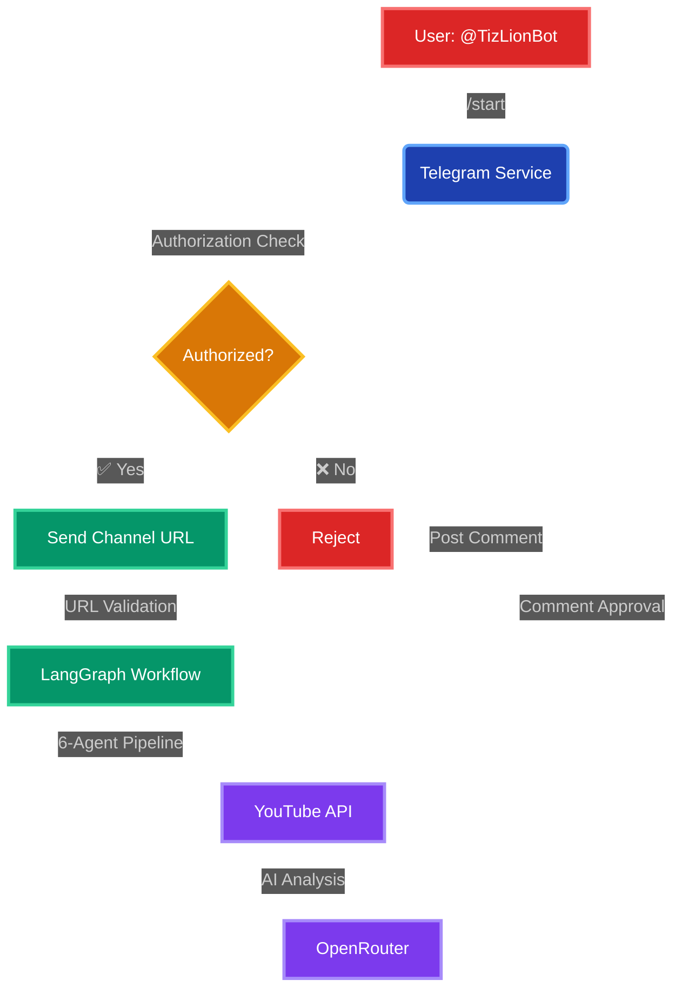

# 🤖 YouTube Comment AI Agent

<div align="center">



**Intelligent YouTube Comment Automation System**

[](https://python.org)
[](https://fastapi.tiangolo.com)
[](https://langchain-ai.github.io/langgraph/)
[](https://hub.docker.com/r/tiz20lion/youbute-comment-ai-agent)
[](LICENSE)

[🎥 **Watch Demo**](https://www.loom.com/share/ebc1e5a6011f440f838176c306b381f9?sid=3b81e1e4-0585-4dc6-9f30-25014948885e) | [📺 **YouTube Channel**](https://www.youtube.com/@TizLionAI) | [🐳 **Docker Hub**](https://hub.docker.com/r/tiz20lion/youbute-comment-ai-agent) | [💼 **LinkedIn**](https://www.linkedin.com/in/olajide-azeez-a2133a258)

</div>

## 🎬 Demo Video

<div align="center">
  <a href="https://www.loom.com/share/ebc1e5a6011f440f838176c306b381f9?sid=3b81e1e4-0585-4dc6-9f30-25014948885e" target="_blank">
    
  </a>
  
  **🎥 [▶️ WATCH FULL DEMO ON LOOM](https://www.loom.com/share/ebc1e5a6011f440f838176c306b381f9?sid=3b81e1e4-0585-4dc6-9f30-25014948885e)**
  
  *Click the image or link above to see the complete 6-agent AI workflow in action*
</div>

## 🏗️ System Architecture

<div align="center">
  
  <p><em>6-Agent Sequential Processing Pipeline with LangGraph Orchestration</em></p>
</div>

### 🔄 Workflow Diagram


```mermaid
%%{init: {'theme':'dark', 'themeVariables': {'primaryColor':'#000000','primaryTextColor':'#ffffff','primaryBorderColor':'#ffffff','lineColor':'#ffffff','sectionBkgColor':'#000000','altSectionBkgColor':'#111111','gridColor':'#333333','secondaryColor':'#000000','tertiaryColor':'#222222','background':'#000000','mainBkg':'#000000','secondBkg':'#111111','tertiaryBkg':'#222222'}}}%%
graph TD
    U[User: @TizLionBot] -->|"/start"| T(Telegram Service)
    T --> |"Authorization Check"| A{Authorized?}
    A -->|"✅ Yes"| W[Send Channel URL]
    A -->|"❌ No"| R[Reject]
    W --> |"URL Validation"| L[LangGraph Workflow]
    L --> |"6-Agent Pipeline"| Y[YouTube API]
    Y --> |"AI Analysis"| O[OpenRouter]
    O --> |"Comment Approval"| T
    T --> |"Post Comment"| Y

    %% Virtual workflow styling with black background
    classDef default fill:#000000,stroke:#ffffff,stroke-width:3px,color:#ffffff,font-size:16px;
    classDef user fill:#dc2626,stroke:#f87171,stroke-width:3px,color:#ffffff,font-size:16px;
    classDef service fill:#1e40af,stroke:#60a5fa,stroke-width:3px,color:#ffffff,font-size:16px;
    classDef decision fill:#d97706,stroke:#fbbf24,stroke-width:3px,color:#ffffff,font-size:16px;
    classDef workflow fill:#059669,stroke:#34d399,stroke-width:3px,color:#ffffff,font-size:16px;
    classDef api fill:#7c3aed,stroke:#a78bfa,stroke-width:3px,color:#ffffff,font-size:16px;
    classDef action fill:#16a34a,stroke:#4ade80,stroke-width:3px,color:#ffffff,font-size:16px;
    classDef reject fill:#dc2626,stroke:#f87171,stroke-width:3px,color:#ffffff,font-size:16px;
    
    %% Apply styles
    class U user;
    class T service;
    class A decision;
    class W,L workflow;
    class Y,O api;
    class R reject;
```

## 🚀 Overview

AI-powered YouTube comment automation with 6-agent workflow and Telegram bot control.

### ✨ Key Features

- 🧠 **6-Agent AI Pipeline** - Smart content analysis and comment generation
- 💬 **Telegram Bot** - Real-time control and approval
- 🔐 **Secure** - OAuth2 YouTube integration

## 🧠 Agent Workflow

1. **🔍 Channel Parser** - Extract video metadata
2. **📝 Content Extractor** - Process descriptions/transcripts  
3. **🕷️ Content Scraper** - Analyze existing comments
4. **🧠 AI Analyzer** - Content analysis with OpenRouter AI
5. **✍️ Comment Generator** - Create human-like comments
6. **🚀 Comment Poster** - Post with OAuth2 authentication

## 🏗️ Technical Architecture

6-agent workflow orchestrated by LangGraph with OpenRouter AI.

## 🛠️ Technology Stack

**FastAPI** • **LangGraph** • **OpenRouter AI** • **Python-Telegram-Bot** • **YouTube API** • **Python 3.8+**

## 📋 Prerequisites

- **Python 3.8+**
- **Google Cloud Project** with YouTube Data API v3
- **OpenRouter API** account  
- **Telegram Bot Token**
- **OAuth2 credentials**

## 🚀 Quick Start

```bash
# Clone repository
git clone https://github.com/Tiz20lion/youbute-comment-AI-agent.git
cd youbute-comment-AI-agent

# Run interactive setup
python startup.py
```

**Docker Alternative:**
```bash
docker run -it --rm -p 8080:8080 --env-file .env tiz20lion/youbute-comment-ai-agent
```

## ⚙️ Configuration

```bash
# Essential API Keys (.env file)
GOOGLE_API_KEY=your_youtube_api_key
OPENROUTER_API_KEY=your_openrouter_key  
TELEGRAM_BOT_TOKEN=your_bot_token
TELEGRAM_ALLOWED_USERS=your_user_id
```

See `example.env` for complete options.

## 🎮 Usage

1. Start chat with your Telegram bot
2. Send `/start` command
3. Send YouTube channel URL
4. Approve/reject generated comments


## 🏗️ Project Structure

```
app/
├── agents/      # 6 AI agents
├── services/    # API integrations  
├── workflow/    # LangGraph orchestration
└── main.py      # FastAPI app
```


## 🤝 Contributing

Fork → Create branch → Commit → Pull Request

## 📄 License

MIT License

## 🙏 Acknowledgments

Thanks to **LangGraph**, **FastAPI**, **OpenRouter**, and **YouTube Data API** teams.

## 📞 Support & Contact

<div align="center">

**Developed by Tiz Lion AI**

[](https://www.youtube.com/@TizLionAI)
[](https://www.linkedin.com/in/olajide-azeez-a2133a258)
[](https://github.com/Tiz20lion)

</div>

---

<div align="center">
  <strong>⭐ Star this repository if you find it useful!</strong>
</div> 